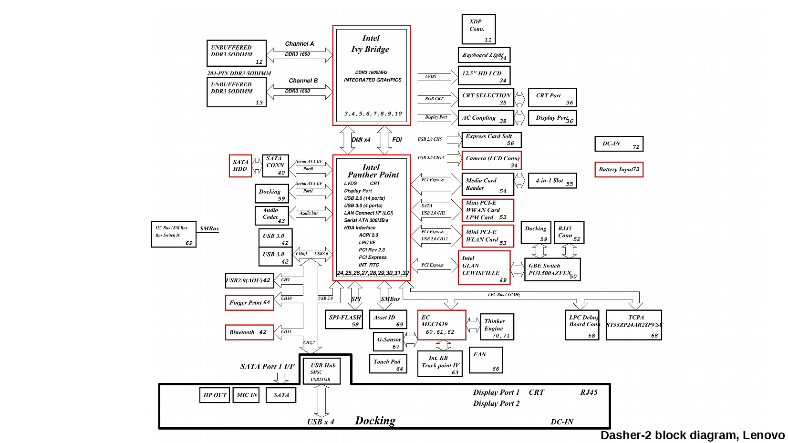
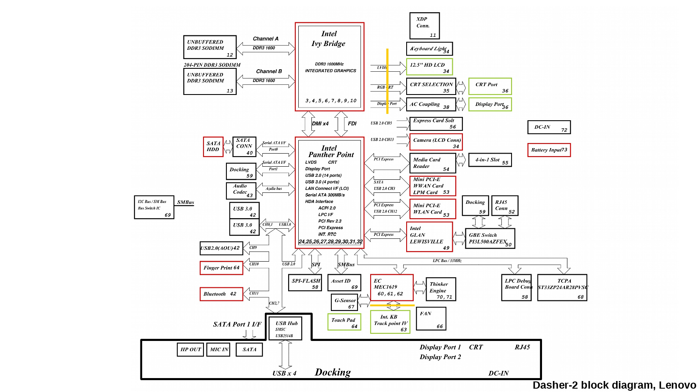
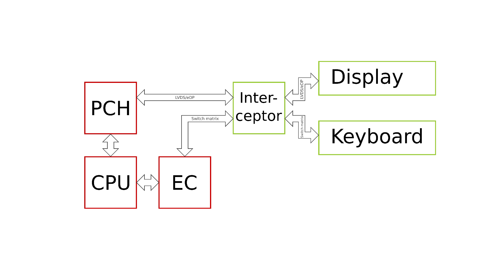
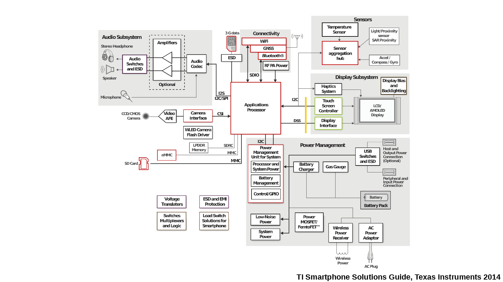
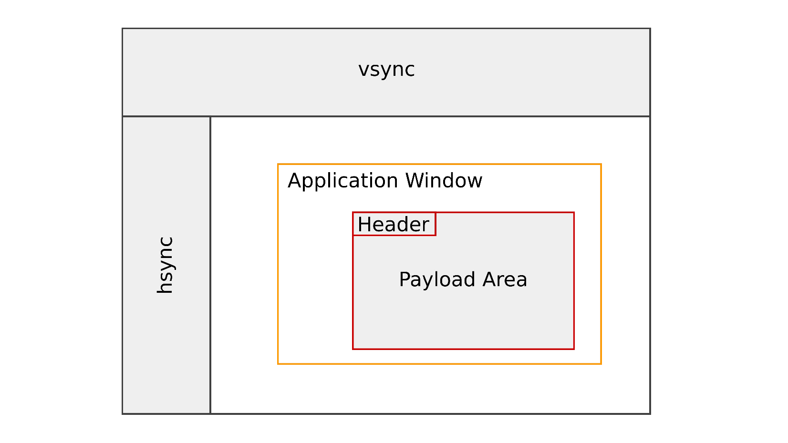
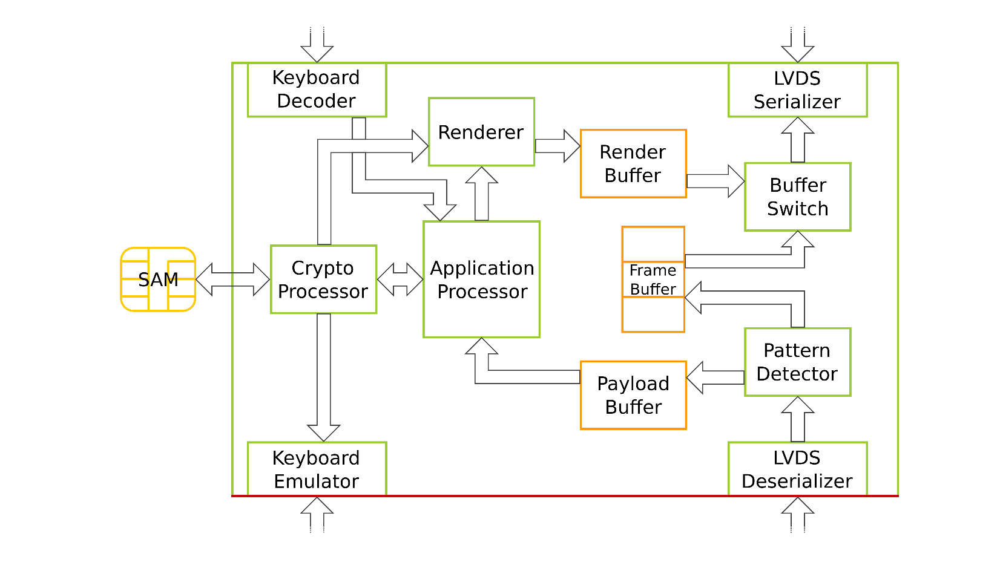

:Author: jaseg
:Contact: 33c3@jaseg.net
:date: $Date: 2016-12-27 18:15:00 +0100 (Tue, 27 Sep 2016) $
:status: This is work in progress.
:revision: 1
:copyright: CC-By-Sa

=====================================
Regaining Trust in Everyday Computers
=====================================

Introduction
============

What's the Problem?
-------------------

We're using computers in most parts of our lives today. For my personal taste, frictionless communication between people
is one of the most important facilities computers provide us with today. One of the most central properties of many such
communication systems is that they allow /private/ communication. This means that we know who we are communicating with,
and that uninvited parties can at the very least not read the contents of our communications.

Today, there are many systems providing this service to us. GPG can be used to make traditional email a little more
private by hiding message content from bystanders. OTR can be used for robust encryption of chat sessions. Signal
improves on many of OTR's properties and is probably one of the most advanced cryptographically secure communication
systems available to us today.

However, in practical use, all of these systems have one fatal issue: No matter how secure the system implementation and
how good its cryptographical foundations, any system is as suceptible as the underlying machine. In case of GPG, OTR and
Signal, the things we write and that these systems aim to securely transmit is processed inside a programm running on a
commodity operating systems on a commodity hardware platform such as x86-64 or some ARM-based smartphone.

The picture above is a block diagram of a Lenovo x230 Laptop, an Intel-based platform. You can already see that this is
a highly complex system. In practice, this comes with lots of interdependencies between components.

To make matters worse, all of the components highlighted in red can be assumed to run proprietary, un-auditable
software.

All of this complexity and the massive amonut of highly-privileged, network-connected, secret firmware exposes a massive
attack surface to any (`well-funded attacker<https://nsa.gov/>`__). Even if a user is running a system secured according
to the state of the art, e.g. running QubesOS in a Secure Boot configuration, massive attack surface remains. There have
been numerous flaws found in both the linux kernel and the Xen Hypervisor. Proprietary firmware has not fared better,
with published hacks of both AMD's SMU firmware and Quallcomm's QSee ARM TrustZone firmware.

Mission Statement
-----------------

In my opinion, we have to solve this issue of trust. Alas, we cannot simply audit the system as-is, since auditing the
enormous amount of binary firmware contained within the system is too much work and and most of this work would have to
be re-done for every new platform. From my point of view, the most realistic way to break this tie is to augment the
system with a simple, auditable coprocessor so that trust can be placed there instead of in the lost rest of the system.

Placing the trust boundary
--------------------------

Looking at the above block diagram, we can see that in order to rule out plaintext data being handled by subsystems
running proprietary firmware, we have to place our trust boundary beyond one very important component: The CPU itself,
for it and the PCH both are running untrusted firmware.

We do have the constraint that at keyboard and display we need to have plaintext data coming through since
"crypto-glasses" are not yet a thing. The only remaining place where we can transform untrusted ciphertext into trusted
plaintext thus is on the display and keyboard matrix buses between PCH and Display, and EC and keyboard, respectively.
In the following discussion, this device will be named "Interceptor".

Device Overview
===============

Outside view
------------

The Interceptor will sit between display and PCH on the LVDS bus as well as between keyboard and EC on the keyboard
matrix lines. LVDS is a comparatively simple, high-speed digital display bus. Electrically it consists of 4-10
differential pairs carrying clock and data signals without any framing information beyond a serialized form of vertical
and horizontal sync signals known from the age of VGA. LVDS is used on almost all older laptops (as well as internally
in LCD monitors). More modern laptops tend to use eDP (embedded DisplayPort) instead, which is a somewhat more complex,
packet based bus (though mostly identical to LVDS on the physical layer).

The keyboard itself is implemented as nothing but a simple, passive matrix of switches that is continuously being
scanned by the embedded controller. Key events are then forwarded to the CPU via an LPC bus.

Compatibility
-------------

Since the Interceptor is inserted into the system at a /very/ low level, by and in itself it is very agnostic to the
underlying system. That means that apart from minor differences in host system integration, without any adaption of the
hardware or firmware it will work across operating systems and even platforms. The latter means that one could even
insert an Interceptor into a contemporary smartphone (ignoring power and space constraints for now), since modern
smartphones are using a display bus similar to the ones used in desktop systems. The primary input method of most
smartphones is the touchscreen, which generally is connected via I2C, which can also easily be intercepted as a simple
serial protocol.

General Implementation
----------------------

LVDS and eDP are very high-bandwidth digital buses. The most obvious device to handle these buses is probably an FPGA.
FPGAs do include serialization and deserialization logic that can easily be adapted to handle all common display buses
and can easily handle simple processing on data at this bandwidth. Furthermore, FPGAs are fundamentally reasonably
simple devices. Compared to e.g. an ARM SoC (such as they are made by Qualcomm, TI or Freescale), its hardware design is
simpler by orders of magnitude. On one hand, this increases the likelihood of verification of one such device ever
happening by keeping the effort required non-astronomical. On the other hand, this configurability allows deep
customization of the used architecture to our needs.

Controlling an Interceptor
--------------------------

In the initial iteration, the Interceptor only has LVDS and keyboard access--no other buses. This greatly reduces design
complexity and attack surface, but it makes controlling the Interceptor from the host system challenging. The initial
approach is to have the area available to it for plaintext rendering used for control data and ciphertext as is shown in
the following image.

In almost all systems, the outermost nested display area is the user's desktop environment. Inside, there may be a
number of independent application windows, each of which may wish to display encrypted data to the user. This encrypted
data (henceforth called "payload") is displayed inside the application window by formatting a bitmap to include some
markers and a header with meta-data, followed by the raw ciphtertext interpreted as RGB pixel data (potential correction
for gamma lookup tables etc. may apply here). The Interceptor is continuously scannig the incoming pixel data for this
marker parttern before forwarding it to the display.

Interceptor Implementation
==========================

Overview
--------

The following diagram shows a proposal for an interceptor design based on some preliminary experiments.

One goal of this design is to keep subsystems entrusted with different responsibilities physically seperated to lessen
the chance of information leaking in case of some components exhibiting unintended behavior. The two most critical data
buses carrying keyboard and display data are only connected to components that actually need access to their respective
signal.

Display Data Handling
---------------------

Display data arrives via LVDS (and in a future revision possibly the packet-based eDP) at the LVDS deserializer. The
high-speed serial LVDS signal is converted into low-speed parallel pixel data for FPGA-internal processing. The pixel
data is forwarded to the pattern detector. The pattern detector is a device that is scanning incoming pixel data for a
fixed pattern signifying the start-of-payload. In case the pattern is not found and the incoming pixel data is not part
of an active payload, the pixel data is directly forwarded to the frame buffer for intermediate storage ([#triplebuf]_).

The output of the pixel data buffer is fed into the buffer switch which in case no payload is being processed will
directly forward it to the output LVDS serializer, which is connected to the display itself. A consequence of this
design is that the raw display signal, except for specific payload, will never touch any part of the system except for
(de)serializer, frame buffer, pattern detector and buffer switch--and all of these devices are implemented in logic
without firmware or complex state machines.

Payload Format
--------------
.. Header format and markers

The general payload format is that 

Payload Handling
----------------

If the payload detector detects a payload, it will divert the incoming payload pixel data to the payload buffer. After
receiving the payload is been completed, the application processor will be notified and starts processing the payload.
After some simple protocol decoding and unwrapping of the embedded cryptographic data this data will be forwarded to the
crypto coprocessor. The crypto coprocessor will perform any necessary cryptographic operations and forward the decrypted
data to the renderer. The renderer most likely will be a processor running the complex software stack necessary to
handle sensible rendering of any appreciable number of writing systems. It renders the incoming unicode data into the
RGB pixel data render buffer. The render buffer content is then dynamically inserted into the in-flight display data
stream by the buffer switch in the same position where the original payload has been extracted.

Crypto Coprocessor Considerations
---------------------------------

The crypto coprocessor is meant to do most of the cryptographic operations that involve either of cryptographic key
material or plaintext data. Its firmware must be kept as simple as possible and any higher logic that can be kept out of
it without compromising either plaintext or key security should be done inside the application processor.

For handling of long-term persistent keys optionally one might consider adding a Secure Access Module/Smartcard to the
system that is connected to the crypto coprocessor.

Any SRAM location or register that is used to store a key for seconds or longer must be periodically be inverted to
avoid data-dependent SRAM cell degradation and the possibility of key compromise. Practically, this means that for any
cryptographic key to be stored in SRAM two memory buffers must be prepared, one keeping the actual key and one its
bitwise inverse. Periodically (say, every 1s), both buffers are inverted bitwise and all references to the non-inverted
buffer are updated. This makes sure that over a long time, every memory location contains both a logic 1 and a logic 0
for exactly half the time independent of the actual key bit stored in this location.

User Interfaces Considerations
==============================

Hardware Security Module
========================

A natural extension of the pure cryptographic security module proposed here is to incorporate actual Hardware Security
Module (HSM) features into it. This mostly encompasses having a number of active intrusion detection techniques that are
continuously being monitored by a circuit powered from an internal backup battery. In case an intrusion is detected,
all cryptographic secrets are securely wiped.

1. Traditional, mesh-based intrusion detection can be very effective if implemented correctly. A combination of a
   gapless, overlapping security mesh printed in silver ink on plastic foil (a process that is used e.g. for rubber dome
   keyboard switch membranes) wrapped around the HSM PCB on all edges potted with a chemically resistant, opaque,
   slightly flexible epoxy resin proved to be very efficient against simple attempts at mechanical intrusion.
2. A number of randomly tangled wires acting as antennae stuffed between the HSM PCB and the inside of an electrically
   conducting enclosure that are continuously monitored for their pairwise complex frequency response by a system
   similar to a vector network analyzer. Ideally, any distortion of these wires or the surrounding potting material
   acting as a dielectric would change these characteristics. Further research is necessary to examine the practical
   sensitivity of such a system and its feasibility concerning price and energy consumption.
3. Ultrasonic transducers planted in several spots (e.g. on the surface of the HSM PCB) on the inside of the HSM are
   continuously monitored for their pairwise ultrasonic coupling characteristics versus frequency. Ideally, any
   mechanical disturbance of the HSM would change its internal acoustic propagation characteristics to a measurable
   extent.
4. Several highly sensitive photodiodes are placed on the HSM PCB and encapsulated in a clear potting material. The
   resulting object is encased in a clear, chemically resistant epoxy potting material filled with ground (but not
   powdered) triboluminescent ("smash-glow" or "friction-glow") crystals. This epoxy layer is optically shielded from
   environmental light by applying a thick coating of dark lacquer on its surface. Ideally, any mechanical disturbance
   of the triboluminescent layer would result in the emission of small flashes of light that can easily be detected by
   photodiodes. This technique might prove very effective against all types of mechanical attacks while still being
   comparatively cheap and very low-energy.

About the author
================

jaseg is a student of computer science at TU Berlin, an electronics and programming hobbyist and is a student employee
at Security Research Labs GmbH.

.. [#triplebuf] This is necessary to cross from the LVDS input clock domain into the system clock domain. Clocking the
    entire system from the LVDS clock is not a realistic option since there are no guarantees made on when this clock
    will be active or its performance characteristics. Especially the serializer should probably be fed from a reliable,
    clean clock source to avoid problems with marginal downstream devices. In contrast to a fully source-synchronous
    implementation this mostly comes at the cost of a higher delay (up to two frames) as compared to several pixels up
    to a few full lines. However, it does provide potential for comparatively painless future extension of the system to
    mutiple inputs or outputs.

